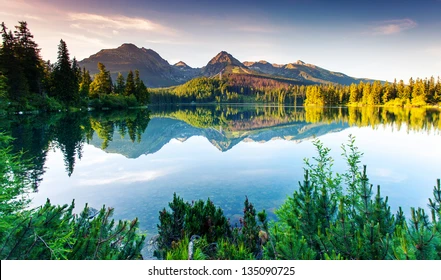
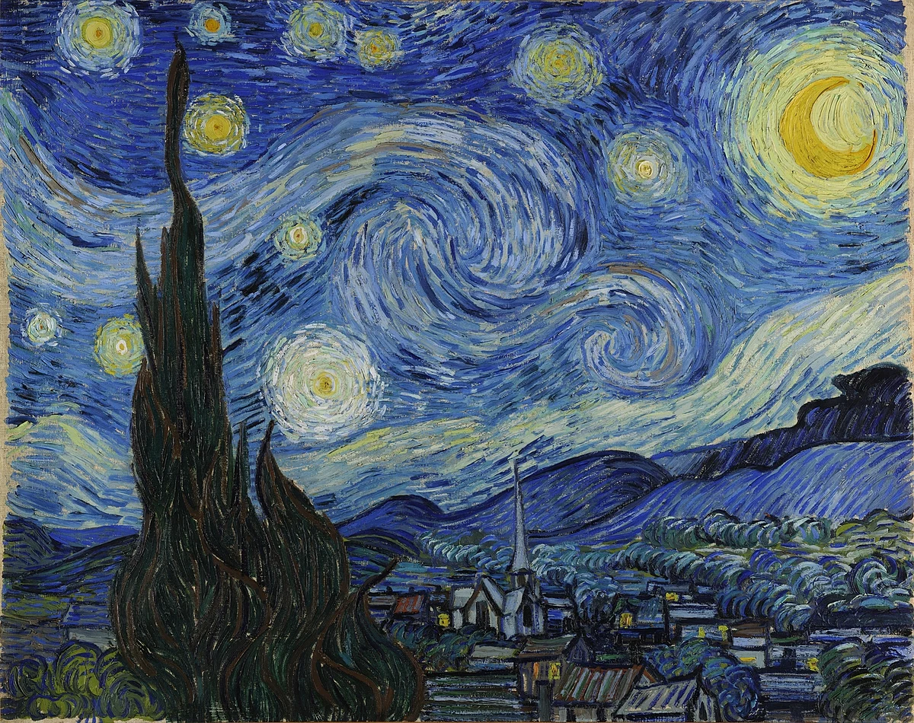
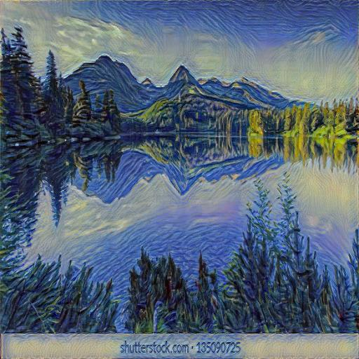

# PRODIGY_GA_05
task-5
---------------------------------------------- 
Neural Style Transfer with PyTorch and VGG19

This project is a Python implementation of the Neural Style Transfer algorithm, as described in the paper "A Neural Algorithm of Artistic Style" by Gatys et al. The script uses a pre-trained VGG19 network to separate and recombine the content of one image with the style of another.

The goal is to generate a new image that retains the main subject and structure of a "content" image, but is "painted" in the artistic style of a "style" image.

Example
Content Image	Style Image	Stylized Output
content.jpg	style.jpg	output.jpg
		
(Note: You will need to provide your own content.jpg and style.jpg images for the above to render correctly.)		
How It Works

The core idea is to use a deep convolutional neural network (CNN), specifically the VGG19 model, which has been pre-trained for image classification. We don't use it for classification, but for its ability to extract features at different layers.

Content Representation: The deeper layers of a CNN capture the high-level content and arrangement of objects in an image, while ignoring finer details like color and texture. We define a Content Loss as the mean-squared error between the feature maps of our content image and the generated image at a specific deep layer.

Style Representation: The style of an image can be represented by the correlations between features in different layers of the CNN. We use a Gram Matrix to calculate these correlations. The Style Loss is the mean-squared error between the Gram matrices of the style image and the generated image, calculated across several layers (from shallow to deep). This captures the texture, colors, and patterns of the style image, independent of the actual content.

Optimization: The process starts with an initial image (a clone of the content image). We then iteratively update this image's pixels using an optimization algorithm (L-BFGS in this script). The goal is to simultaneously minimize both the Content Loss and the Style Loss. By adjusting the weights of these two losses, we can control whether the final image prioritizes matching the content or the style.

Requirements

You'll need Python and the following libraries:

torch & torchvision: For deep learning and the VGG model.

Pillow (PIL): For loading and saving images.

matplotlib: For displaying the final image (optional).

Setup

Clone the repository or download the files.

Create a Virtual Environment (Recommended):

Generated bash
python -m venv venv
source venv/bin/activate  # On Windows, use `venv\Scripts\activate`

Install the dependencies:
Create a file named requirements.txt with the following content:

Generated code
torch
torchvision
Pillow
matplotlib
IGNORE_WHEN_COPYING_START
content_copy
download
Use code with caution.
IGNORE_WHEN_COPYING_END

Then, install them using pip:

Generated bash
pip install -r requirements.txt
IGNORE_WHEN_COPYING_START
content_copy
download
Use code with caution.
Bash
IGNORE_WHEN_COPYING_END

Add Your Images:

Place your content image in the project directory and name it content.jpg.

Place your style image in the project directory and name it style.jpg.

Usage

To run the style transfer process, simply execute the Python script from your terminal:

Generated bash
python your_script_name.py
IGNORE_WHEN_COPYING_START
content_copy
download
Use code with caution.
Bash
IGNORE_WHEN_COPYING_END

(Replace your_script_name.py with the actual name of your Python file.)

The script will print the loss values every 50 steps. Once complete, it will:

Save the final image as output.jpg.

Display the generated image in a Matplotlib window.

Code Breakdown

This script is organized into several key parts:

1. Image Utilities (load_image, save_image)

load_image: Opens an image file, converts it to RGB, resizes it to a standard size (512x512), transforms it into a PyTorch tensor, and moves it to the appropriate device (GPU or CPU).

save_image: Converts the output tensor back into a PIL image and saves it to a file. It also clamps the pixel values between 0 and 1 to ensure it's a valid image.

2. Core Components (GramMatrix, ContentLoss, StyleLoss)

gram_matrix: A function that takes a feature map tensor and calculates its Gram matrix, which is essential for capturing style.

ContentLoss: An nn.Module that calculates the mean-squared error between the feature map of the generated image and the target content image's feature map.

StyleLoss: An nn.Module that calculates the mean-squared error between the Gram matrix of the generated image's features and the target style image's Gram matrix.

3. Model Setup

Loading VGG19: The script loads the pre-trained VGG19 model from torchvision and uses only its feature extraction layers (.features). The model is set to evaluation mode (.eval()) since we are not training it.

Normalization: A custom Normalization module is created to normalize the input images using the mean and standard deviation that the VGG19 model was trained on. This is a crucial step for getting meaningful features.

Building the Custom Model: The script dynamically builds a new nn.Sequential model. It iterates through the layers of VGG19, adding them one by one. After specific convolutional layers (defined in content_layers and style_layers), it inserts the ContentLoss and StyleLoss modules. This allows us to capture losses at multiple depths of the network. The model is then trimmed to only include layers up to the last loss module for efficiency.

4. Optimization Loop

Optimizer: The L-BFGS optimizer is used, which is well-suited for this type of optimization problem. It's configured to optimize the input_img tensor directly.

closure() function: This is the core of the training loop. L-BFGS requires a function (a "closure") that it can call multiple times to re-evaluate the model. Inside the closure, we:

Clear previous gradients.

Pass the input_img through our custom model to compute the features and calculate the losses.

Sum up the style and content losses.

Calculate the total loss, weighted by style_weight and content_weight.

Compute the gradients (loss.backward()).

Return the total loss.

The while loop runs the optimizer, which repeatedly calls the closure function to update the input_img until num_steps is reached.

Customization

You can easily experiment with the results by changing these parameters in the script:

Images: Use different content.jpg and style.jpg files.

Weights: Adjust style_weight and content_weight.

A higher style_weight will make the output look more like the style image.

A higher content_weight will make the output retain more of the content image's structure.

Layers: Modify the content_layers and style_layers lists to use features from different parts of the VGG network. Using earlier layers for content (conv_1, conv_2) will result in a more abstract, texture-focused transfer.

Image Size: Change the size tuple in the load_image function. Larger images will produce more detailed results but require more memory and time.

Steps: Increase or decrease num_steps to run the optimization for a longer or shorter duration. More steps usually lead to a more refined result.
